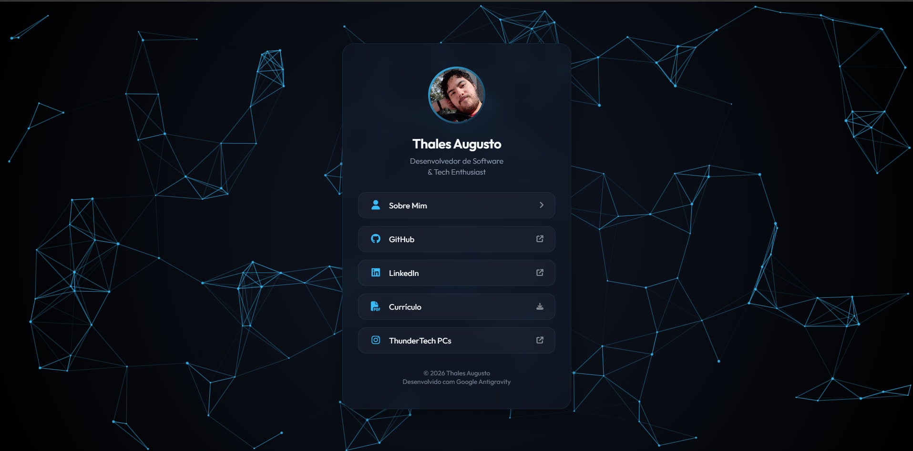

# Link Aggregator & Digital Portfolio

Um portfólio e agregador de links moderno, projetado com estética premium "Glassmorphism" e fundo interativo, servindo como cartão de visita digital e currículo online.

🔗 **Demo Live:** [https://thalesauc.github.io/AgregadorLinks/](https://thalesauc.github.io/AgregadorLinks/)

## ✨ Funcionalidades

- **Design Premium**: Interface moderna com efeito Glassmorphism (vidro fosco).
- **Fundo Interativo**: "Nuvem de Partículas" (Particles Network) desenvolvida com HTML5 Canvas que reage ao movimento do mouse.
- **Modo Escuro**: Paleta de cores imersiva em "Deep Dark Blue" para destaque do conteúdo.
- **Responsividade**: Layout totalmente adaptável para mobile, tablet e desktop.
- **Micro-interações**: Animações suaves de hover nos botões e entrada de elementos.
- **Páginas**:
  - `index.html`: Links de contato, redes sociais e download de currículo.
  - `about_me.html`: Biografia detalhada com styling consistente.

## 🛠 Tecnologias Utilizadas

- **HTML5**: Estrutura semântica e acessível.
- **CSS3**: Layout Flexbox, Variáveis CSS, Backdrop-filter e Animações.
- **JavaScript**: Lógica de renderização do Canvas para o efeito de partículas (`particles.js`).
- **FontAwesome**: Ícones vetoriais.
- **Google Fonts**: Tipografia `Outfit`.
---
Desenvolvido por **Thales Augusto**
